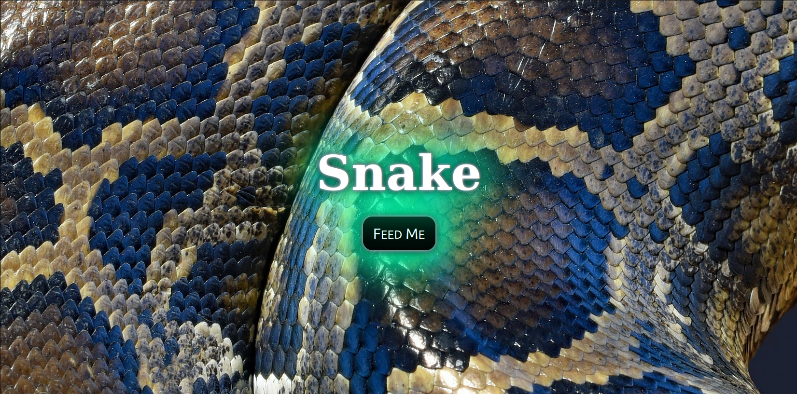
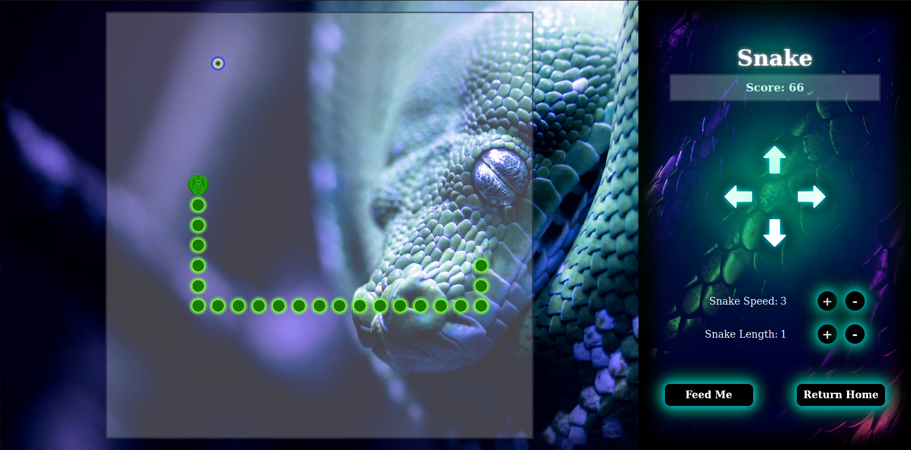

# Description
Snake is a classic game whereby the player controls the snake and is rewarded points for eating the 'food'.  The goal is to get the most points possible without crashing into the edge of the board or the body of your snake.  Test your skills and see how high you can get your best score!

Live Site: https://jagerziel.github.io/Snake/

# Screens

### Home Page


### Snake Game


# How the Code Works

## Controlling the Interface
Controlling the snake is determined by 'click' events or using the arrow keys.  Increasing the speed or length of the snake is determined by 'click' events.

## The Board
The board is set up using grid.  The sizing is arranged to dynamically change with the window size.

## The Board vs the Control Panel
The window is split into two sections at approximately a 70/30 split (depending on screen size).  The CSS controls on the right side ensure the collapse will not interfere with the controls.  With that said, there are minimum screen sizes set for both so at some point a scrollbar will appear either horizontally or vertically.  It is encouraged to play the game at the proper size for best enjoyment.

## Score
The score is determined by multiplying the snake speed and snake length.

## Timing
The time is controlled by `window.requestAnimationFrame()`. The snake speed is a subset of that and controlled in game.js.  Below is a snippet of the code:

```
    //Animate and Draw Snake
    window.requestAnimationFrame(main)
    const secondsSinceLastRender = (currentTime - lastRenderTime) / 1000
    if (secondsSinceLastRender < 1 / ((snakeSpeed * 1.7) + 3)) return
    lastRenderTime = currentTime
```

## Death
The snake death occurs when the snake either touches a border or itself.  This is determined by tracking the intersection against the border and the array that draws the snake.  If this occurs, the end game sequence is triggered.


# Future Features
- Link with Other Games
- Smooth Tranitions for Snake Movement
- Bonus food at randomized times
- Maintain high scores between games
